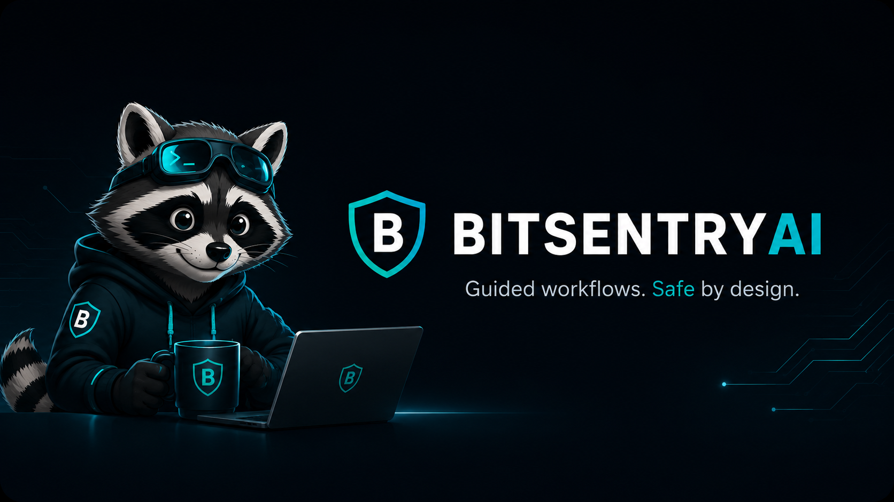

# BitsentryAI




**Convierte OpenCode en un espacio de trabajo guiado para seguridad y desarrollo.**

BitsentryAI instala flujos de trabajo locales, habilidades, prompts, comandos y salvaguardas de seguridad en OpenCode, para que los desarrolladores puedan pasar de chats ambiguos con IA a un trabajo estructurado y auditable: diseño de funciones, investigación de repositorios, triaje de soporte y revisión de seguridad.

Está diseñado para personas que buscan asistencia de IA sin automatización oculta, acciones descontroladas o comportamientos de seguridad inseguros.

> Estado del MVP público: **prioridad local, prioridad OpenCode, flujos de trabajo guiados, seguro por defecto.**

---

## ¿Por qué BitsentryAI?

Las herramientas de programación con IA son potentes, pero a menudo carecen de estructura.

Pueden saltar a las ediciones demasiado pronto, olvidar el contexto del proyecto, mezclar la investigación con la implementación o comportarse de manera impredecible durante el trabajo relacionado con la seguridad. BitsentryAI añade una capa de control local alrededor de OpenCode para que las sesiones asistidas por IA sean más claras, seguras y fáciles de repetir.

BitsentryAI te ayuda a responder preguntas como:

* ¿Qué flujo de trabajo debe seguir esta solicitud?
* ¿Debe el agente investigar, planificar, revisar o editar?
* ¿Qué habilidades y prompts son relevantes?
* ¿Qué debe ser de solo lectura?
* ¿Qué requiere confirmación?
* ¿Qué salvaguardas se aplican antes de tocar código, secretos o objetivos en vivo?

El objetivo es simple: **menos chat caótico de IA, más trabajo de ingeniería guiado.**

---

## Qué hace actualmente

BitsentryAI ofrece actualmente:

* **Instalación priorizando la TUI** para configuración local, comprobaciones de estado e integración guiada de OpenCode.
* **Integración nativa de OpenCode** con un agente `bitsentry`, comandos `/bit-*`, prompts y paquetes de capacidades locales.
* **Enrutamiento consciente de la intención** para flujos de trabajo de desarrollo, investigación, soporte y seguridad.
* **Paquetes de capacidades** que contienen flujos, habilidades, roles, comandos y contratos de prompts.
* **Flujos de trabajo de revisión de seguridad del código fuente** con comportamiento de solo lectura por defecto y hallazgos/informes estructurados.
* **Flujos de planificación de evaluación web** con autorización estricta y controles de seguridad.
* **Herramientas de diagnóstico/estado** para solucionar problemas de preparación local.
* **Valores predeterminados priorizando la seguridad**: sin tiempo de ejecución autónomo oculto, sin acceso a secretos, sin pruebas en vivo descontroladas.

---

## Idea central

BitsentryAI no intenta reemplazar a OpenCode.

**Enriquece OpenCode** instalando una capa estructurada de flujos de trabajo y salvaguardas a su alrededor:

```text
Developer request
      ↓
Bitsentry route decision
      ↓
Relevant flow / skill / role
      ↓
OpenCode-guided work
      ↓
Structured output, gates and next steps
```

En lugar de pedirle a un agente de IA que “simplemente haga la tarea”, BitsentryAI le ayuda a decidir si la solicitud se maneja mejor como:

* una respuesta directa,
* un flujo de trabajo de diseño de software,
* una investigación de repositorio,
* un triaje de soporte,
* una revisión de seguridad del código fuente,
* o una tarea de planificación de evaluación con alcance definido.

---

## Inicio rápido

### 1. Clonar el repositorio

```bash
git clone https://github.com/andrade-fs/bitsentry-ai.git
cd bitsentry-ai
```

### 2. Compilar el binario

```bash
go build -o bin/bitsentry-ai ./cmd/bitsentry-ai
```

### 3. Ejecutar la TUI del instalador

```bash
./bin/bitsentry-ai tui
```

Usa el flujo de **Instalación / Configuración** para detectar OpenCode, exportar el paquete local de Bitsentry e instalar la integración nativa de OpenCode.

El instalador está diseñado para mostrar lo que hará antes de aplicar los cambios.

---

## Uso con OpenCode

Después de la instalación, abre OpenCode y usa el agente `bitsentry`.

Ejemplos de prompts:

```text
@bitsentry Analyze this repository structure.
Do not access .env or secrets.
Return a route decision, relevant files, risks and a suggested next workflow.
```

```text
@bitsentry Start a source security review.
Read-only only. No exploits, no live targets, no code edits.
```

```text
@bitsentry Help me design a new feature using SDD.
Start with scope, assumptions and acceptance criteria.
```

```text
@bitsentry Review this bug and decide whether we need support triage, repository discovery or a design flow.
Do not edit files unless I explicitly approve it.
```

BitsentryAI también instala plantillas de comandos `/bit-*` en OpenCode, como:

* `/bit-install-check`
* `/bit-pack-status`
* `/bit-sdd-init`
* `/bit-sdr-capture`
* `/bit-support-triage`

Estos comandos están diseñados para facilitar el inicio de flujos de trabajo guiados comunes desde dentro de OpenCode.

---

## Flujos de trabajo principales

### Desarrollo de Diseño de Software — SDD

Usa SDD cuando quieras diseñar o implementar una función con estructura.

Casos de uso típicos:

* planificación de nuevas funciones,
* criterios de aceptación,
* diseño técnico,
* implementación por fases,
* cambios de código tras aprobación explícita.

Postura predeterminada: **no mutante hasta que se apruebe la aplicación.**

---

### Investigación de Diseño de Software — SDR

Usa SDR cuando necesites entender un repositorio, arquitectura, área de función o decisión técnica antes de cambiar algo.

Casos de uso típicos:

* análisis de repositorio,
* descubrimiento de arquitectura,
* viabilidad de funciones,
* investigación de deuda técnica,
* mapeo de la base de código.

Postura predeterminada: **investigación de solo lectura.**

---

### Flujo de soporte

Usa el flujo de soporte cuando necesites triar un problema, recopilar evidencia, entender síntomas o preparar una transición limpia.

Casos de uso típicos:

* triaje de errores,
* notas de incidentes,
* investigación de soporte,
* pasos de reproducción,
* resúmenes de transición.

Postura predeterminada: **diagnosticar antes de cambiar.**

---

### Revisión de Seguridad del Código Fuente

Usa este flujo cuando quieras una revisión de seguridad segura y basada en código fuente de un repositorio.

Casos de uso típicos:

* revisión de autenticación,
* revisión de JWT/sesiones,
* revisión de seguridad GraphQL,
* revisión de carga de archivos,
* revisión de SSRF,
* revisión de XSS,
* revisión de exposición de secretos,
* revisión de riesgos de dependencias.

Postura predeterminada: **solo lectura, sin explotaciones, sin objetivos en vivo, sin acceso a secretos.**

---

### Planificación de Evaluación Web

BitsentryAI incluye flujos de evaluación web orientados a la planificación, pero el MVP público mantiene intencionalmente límites de seguridad estrictos.

Casos de uso típicos:

* planificación de evaluación autorizada,
* definición de alcance,
* preparación de planes de prueba,
* revisión de solicitudes,
* estructura de hallazgos/informes.

Postura predeterminada: **primero planificación, controlado por autorización, sin pruebas autónomas.**

---

## Seguridad por diseño

BitsentryAI es intencionalmente conservador.

Salvaguardas actuales del MVP público:

* Sin tiempo de ejecución autónomo oculto.
* Sin ediciones de código descontroladas.
* Sin análisis de `.env` o secretos.
* Sin extracción de credenciales.
* Sin ejecución web en vivo por defecto.
* Sin integraciones de escáneres, rastreadores o fuzzers.
* Sin comportamiento de pentesting con un clic.
* Sin ejecución de exploits.
* Sin acciones destructivas.
* Confirmación manual antes de cambios impactantes.

Esta no es una limitación oculta en la letra pequeña. Es una decisión central del producto.

BitsentryAI está diseñado para flujos de trabajo locales controlados donde el usuario mantiene el control.

---

## ¿Qué se instala en OpenCode?

Una configuración nativa de OpenCode puede incluir:

```text
<opencode-config-root>/bitsentry/
├── agents/
│   └── bitsentry.md
├── commands/
│   └── bit-*.md
├── flows/
├── skills/
├── roles/
├── OPENCODE_USAGE.md
└── skill-registry.md
```

BitsentryAI también puede actualizar la configuración de OpenCode para registrar el agente `bitsentry` y las plantillas de comandos.

La postura del agente de OpenCode pretendida es segura por defecto:

```json
{
  "agent": {
    "bitsentry": {
      "mode": "primary",
      "permission": {
        "edit": "deny",
        "bash": "ask"
      }
    }
  }
}
```

---

## Comprobaciones locales

Comandos útiles durante el desarrollo:

```bash
go test ./...
```

```bash
./bin/bitsentry-ai doctor
```

```bash
./bin/bitsentry-ai version
```

La CLI existe principalmente como tubería local, pruebas y diagnóstico. La experiencia de usuario principal está destinada a ser **OpenCode + TUI**.

---

## Estado del proyecto

BitsentryAI se encuentra actualmente en una etapa de MVP público.

El MVP se centra en:

* instalación local,
* integración con OpenCode,
* flujos de trabajo guiados,
* vistas previas de decisiones de enrutamiento,
* revisión de seguridad del código fuente,
* planificación de evaluación segura,
* preparación para demostraciones públicas,
* salvaguardas estrictas.

Aún no es una plataforma de agente autónomo de propósito general, motor de automatización de pentesting o escáner.

---

## ¿Para quién es esto?

BitsentryAI es para:

* desarrolladores que usan OpenCode y quieren más estructura que un chat básico,
* ingenieros de seguridad que buscan flujos de trabajo de revisión seguros, con alcance definido y de solo lectura por defecto,
* líderes técnicos que desean planificación e investigación asistida por IA repetibles,
* constructores que experimentan con agentes de IA locales, MCPs y paquetes de flujos de trabajo,
* equipos que quieren asistencia de IA con límites explícitos y salidas revisables.

---

## Dirección de la hoja de ruta

La dirección actual es:

1. Estabilizar el MVP público priorizando OpenCode.
2. Mejorar los flujos de trabajo guiados y los contratos de seguridad.
3. Fortalecer la revisión de seguridad del código fuente y la planificación de evaluación.
4. Ampliar las integraciones controladas solo cuando el modelo de seguridad sea sólido.
5. Más adelante, dar soporte a otros entornos de programación con IA además de OpenCode.

BitsentryAI se construye intencionalmente paso a paso: primero control, luego capacidad, y luego automatización solo donde sea segura y explícita.

---

## Principios de desarrollo

BitsentryAI sigue algunos principios estrictos:

* **Prioridad OpenCode**: el objetivo actual es OpenCode.
* **Prioridad local**: instalar y ejecutar localmente.
* **Controlado por el usuario**: sin comportamiento autónomo oculto.
* **Primero solo lectura**: especialmente para seguridad y análisis de repositorios.
* **Controles explícitos**: las acciones arriesgadas requieren confirmación.
* **Sin acceso a secretos**: `.env` y datos sensibles quedan fuera del alcance.
* **Salidas estructuradas**: los hallazgos, informes y decisiones deben ser revisables.
* **Capacidades compusibles**: flujos, habilidades, roles y comandos deben evolucionar de forma independiente.

---

## Contribuir

Las contribuciones deben preservar la postura de seguridad central del proyecto.

Antes de abrir una solicitud de extracción (pull request), asegúrate de que:

* `go test ./...` se ejecute correctamente,
* no se comprometan secretos ni credenciales locales,
* la integración de OpenCode permanezca segura por defecto,
* los flujos de seguridad permanezcan de solo lectura por defecto a menos que estén explícitamente controlados,
* README/docs describan con precisión el comportamiento actual.

---

## Licencia

Agrega aquí la información de la licencia del proyecto.

---

## Resumen en una línea

**BitsentryAI es una capa de flujos de trabajo y seguridad local para OpenCode: convierte las sesiones de programación con IA en flujos de trabajo de desarrollo y seguridad guiados y auditables.**
